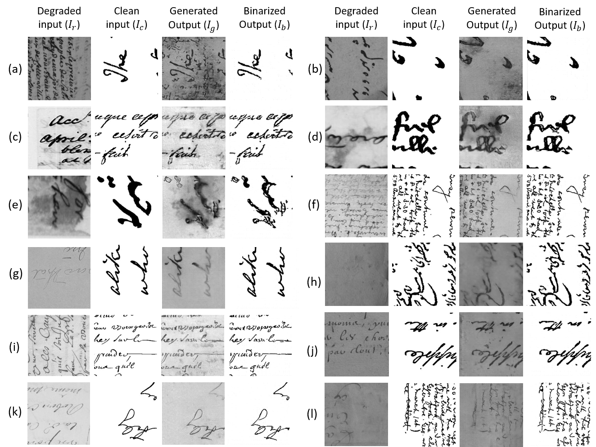
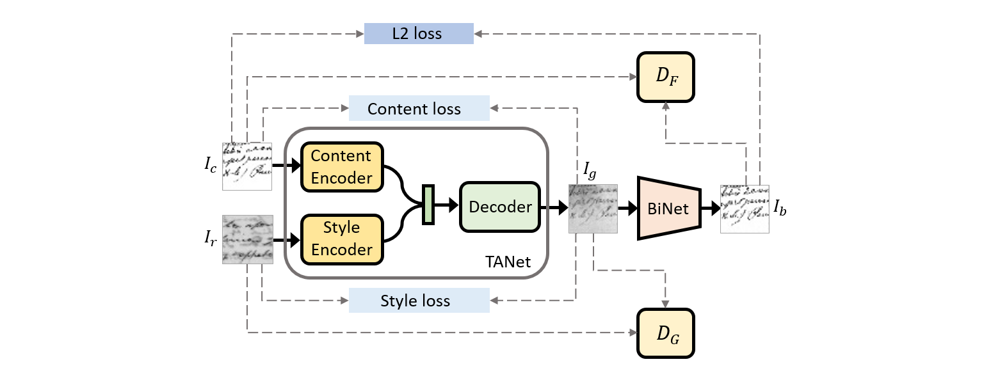

# Improving Document Binarization via Adversarial Noise-Texture Augmentation [[paper](https://arxiv.org/abs/1810.11120v1)] [ICIP 2019]
This repository contains the full source codes and instructions to use the codes on the datasets described in the paper. The paper re-visits the binarization problem by introducingan adversarial learning approach.
### The most significant contribution of our framework is that it does not require any paired data unlike other Deep Learning-based methods [ronneberger et al., Vo et al.,Konwer et al.].Such a novel approach has never been implemented earlier thus making it the very first of its kind in Document Image Analysis community.

In this paper, we propose
a two-stage network that first learns to augment the document
images by using neural style transfer technique. For this
purpose, we construct a Texture Augmentation Network that
transfers the texture element of a degraded reference document
image to a clean binary image. 

In this way, the network
creates multiple versions of the same textual content
with various noisy textures, enlarging the available document
binarization datasets. At last, the newly generated images
are passed through a Binarization network to get back the
clean version.

## Pre-requisites

- python 2.7
- Tensorflow 
- OpenCV
- matplotlib

## Training

- A total of
9 datasets are used in this work: [DIBCO 2009](http://users.iit.demokritos.gr/~bgat/DIBCO2009/benchmark/), [DIBCO 2011](http://utopia.duth.gr/~ipratika/DIBCO2011/benchmark/), [DIBCO 2013](http://utopia.duth.gr/~ipratika/DIBCO2013/benchmark/), [H-DIBCO 2010](http://users.iit.demokritos.gr/~bgat/H-DIBCO2010/benchmark/), [HDIBCO 2012]( 	http://utopia.duth.gr/~ipratika/HDIBCO2012/benchmark/), [H-DIBCO 2014](http://users.iit.demokritos.gr/~bgat/HDIBCO2014/benchmark/), [Bickley diary](https://ieeexplore.ieee.org/document/6373726/),
[PHIDB](http://www.iapr-tc11.org/mediawiki/index.php/Persian_Heritage_Image_Binarization_Dataset_(PHIBD_2012)), and [S-MS](https://iapr.org/archives/icdar2015/index.html%3Fp=254.html) datasets. 
- Out of these datasets,
DIBCO 2013 dataset is selected for testing purposes. For the
testing, the remaining datasets are used as a training set.
- We convert the images from these datasets to patches
of size 256 X 256.
- Download the VGG weights from [here](https://drive.google.com/open?id=1tRJ4rQP83PsSO1m037Fp3M9DCVp2WA5Z) and put it in the repository folder.
- To train the model run the 'train.py' file

## Citation
If you find this code useful in your research, please consider citing:

    @article{bhunia2018improving,
      title={Improving Document Binarization via Adversarial Noise-Texture Augmentation},
      author={Bhunia, Ankan Kumar and Bhunia, Ayan Kumar and Sain, Aneeshan and Roy, Partha Pratim},
      journal={arXiv preprint arXiv:1810.11120},
      year={2018}
    }

